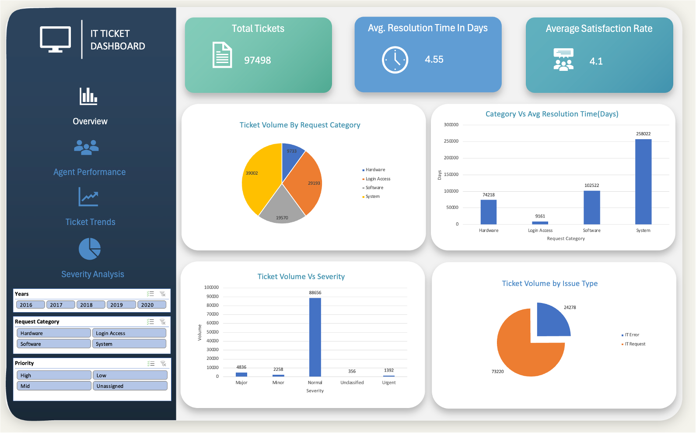
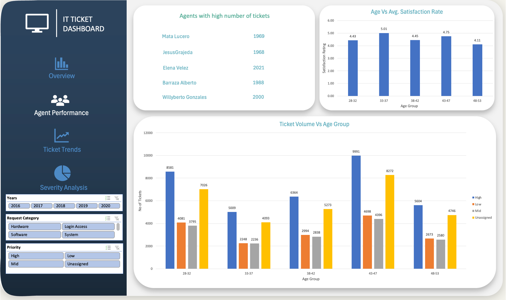
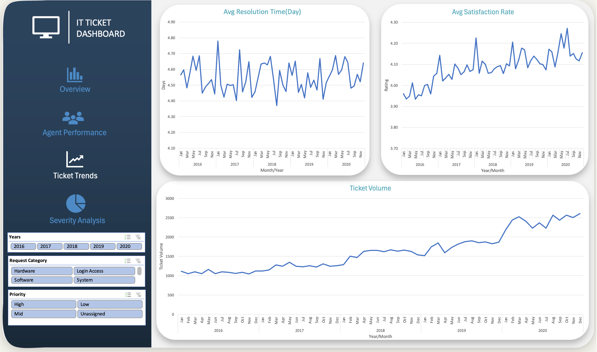
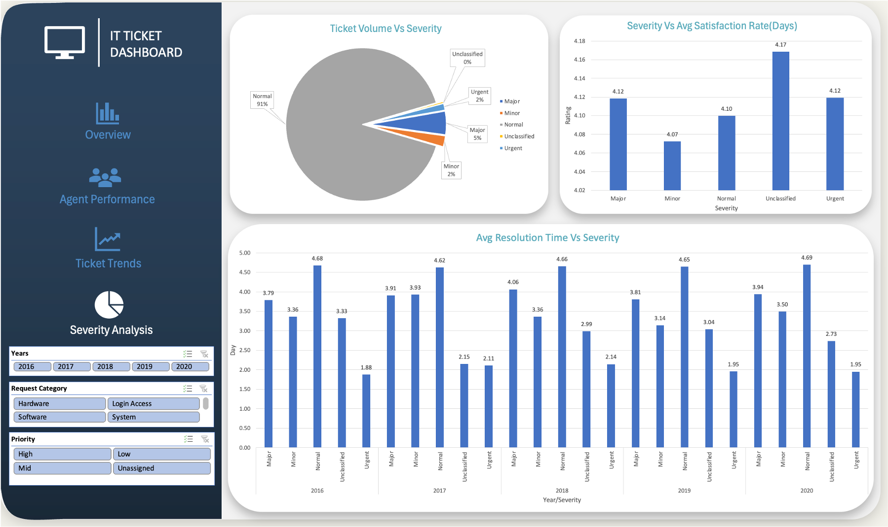

## 🚀 IT Ticket Analysis Dashboard 📊
This project presents an interactive dashboard for analyzing IT support ticket data. The primary objective is to optimize IT support operations by gaining insights into agent performance, resolution efficiency, and employee satisfaction. The analysis aims to provide a clear roadmap for transforming a reactive support function into a proactive and scalable operation.

## 🌟 Project Overview ✨
This project is a comprehensive analysis of an IT support ticket management system. The core of the work involves processing data from various sources to identify key trends, performance bottlenecks, and areas for improvement. The analysis focuses on understanding how ticket volume, resolution times, and agent performance impact overall employee satisfaction. The final dashboard serves as a strategic tool for management to make data-driven decisions on staffing, training, and technology investments.

## 🎯 Key Objectives 🎯
The main goal of this project is to analyze the IT support ticket management system to understand:

🧑‍💼 Agent Performance: Identify high and low performers among IT agents by analyzing the number of tickets handled.

⏱️ Resolution Efficiency: Assess the overall effectiveness of the team and pinpoint areas for improvement in the ticket resolution process.

😊 Employee Satisfaction: Analyze satisfaction levels and how they correlate with other metrics.

The insights from this analysis will guide strategic decisions related to staffing, training, and technology investment to enhance overall service quality and team effectiveness.

## 📁 Data Sources 📁
The analysis is based on three primary datasets:

📊 IT Tickets Analysis.xlsb: Contains detailed information about IT support tickets, including ticket ID, date, category, and resolution details.

📄 Presentation.pptx: Provides a comprehensive overview of the project's problem statement, objectives, and key findings.

📝 Tasks.docx: Outlines the specific questions and metrics used to guide the dashboard development.

📊 Dashboard Metrics and Key Questions 📋
The dashboard was developed to address the following key questions and provide a comprehensive view of performance:

📈 Ticket Volume: What is the average daily ticket volume over time?

🥧 Ticket Distribution: What is the distribution of ticket categories (e.g., Login Access, System, Software)?

🧑‍💻 Agent Performance: How many tickets has each agent handled?

⚠️ Inconsistent Data: Which columns have inconsistent or missing values, and what is the count of such values?

The final dashboard includes the following metrics to provide a comprehensive view of performance and guide investment decisions:

✅ Average Resolution Time

✅ Average Satisfaction Rating

✅ Severity-based visualization

✅ Performance trends

✅ Volume of tickets handled

✅ Performance of agents

## 🎨 Dashboard Visualizations 🖼️

| Dashboard Image 1 | Dashboard Image 2 |
|---|---|
|  |  |
| *Overview of tickets* | *Agent Performance* |

| Dashboard Image 3 | Dashboard Image 4 |
|---|---|
|  |  |
| *Ticket Trend Analysis* | *Severity Analysis* |
